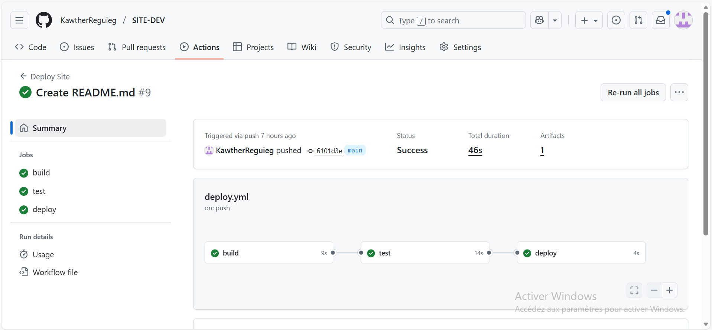
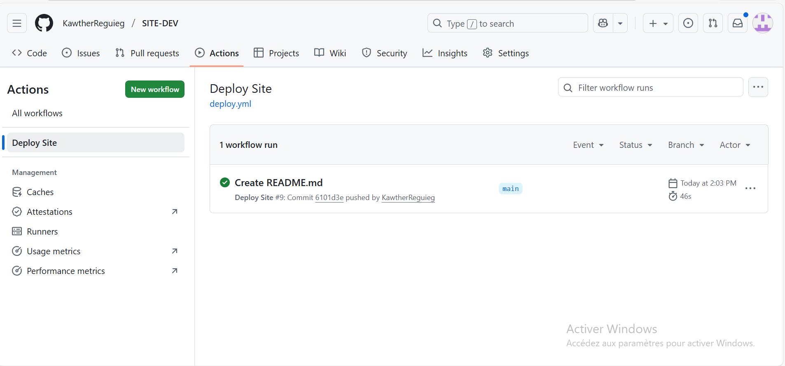
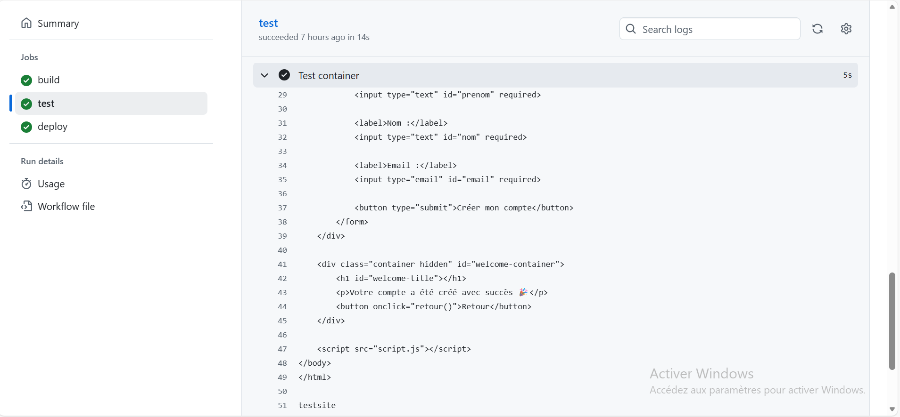
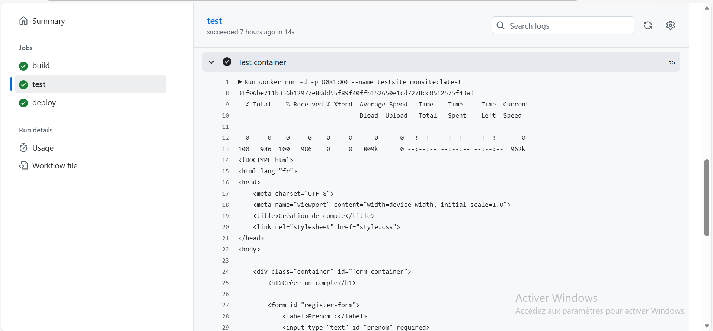
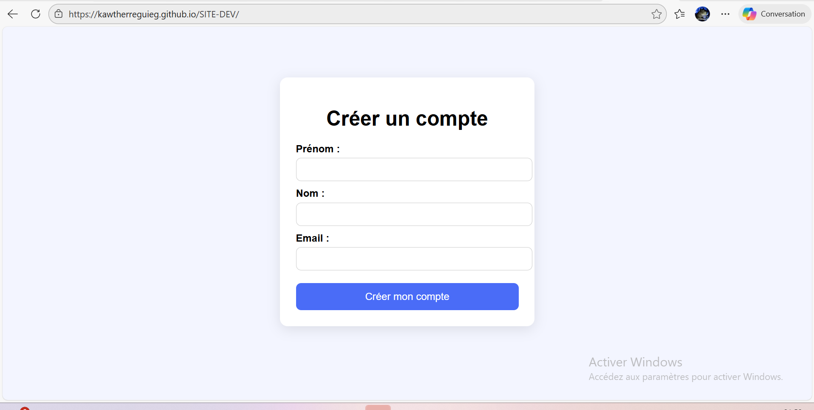

# Déploiement Automatisé d’un Site Web

## 1. Objectif du projet
L'objectif principal est de créer un site web statique, de le containeriser avec Docker, et de mettre en place une pipeline CI/CD automatisée sur GitHub Actions pour tester et déployer le site sur GitHub Pages.

---

## 2. Contenu du projet
Le projet est organisé ainsi :
```text
SITE-DEV/
│── .github/workflows/deploy.yml
│── images
│── Dockerfile
│── index.html
│── README.md
│── script.js
│── style.css

```

---

## 3. Dockerfile

Le Dockerfile est minimaliste et adapté au projet :

```dockerfile
FROM nginx:alpine  utilise une image légère de Nginx.
COPY . /usr/share/nginx/html copie tous les fichiers du projet dans le dossier où Nginx sert le site.

```

## 3. Configuration Git et préparation du projet

Avant de mettre en place la pipeline CI/CD, le projet a été préparé et versionné avec Git afin d’assurer un suivi clair des modifications et de permettre le déclenchement automatique de la pipeline.

### Étapes réalisées

**1. Initialisation du dépôt local**  
Le dépôt Git a été initialisé dans le dossier du projet :
avec: git init
**2. Ajout des fichiers et commit initial**
Tous les fichiers du site (HTML, CSS, JS, Dockerfile) ont été ajoutés et le premier commit a été effectué :
 avec :
 ```bash
 git add .
git commit -m "Initial commit"
```
**3. Création du dépôt distant et connexion**
 https://github.com/KawtherReguieg/SITE-DEV.git
Un dépôt a été créé sur GitHub et lié au dépôt local pour permettre la synchronisation :
avec: 
```bash
git remote add origin https://github.com/KawtherReguieg/SITE-DEV.git
git push -u origin main
 ```
Grâce à cette configuration, le projet est maintenant versionné, et chaque push sur la branche main déclenche automatiquement la pipeline CI/CD.

## 4. Pipeline CI/CD (GitHub Actions)

La pipeline GitHub Actions est composée de **trois jobs principaux** : **build**, **test** et **deploy**.  
Chaque job dépend du précédent grâce à l’instruction `needs:`, ce qui garantit que le déploiement ne se fait que si les étapes précédentes réussissent.

### 4.1 Job Build

Le job **build** a pour rôle de préparer l’image Docker du site :  

- Cloner le dépôt depuis GitHub pour récupérer tous les fichiers.  
- Construire l’image Docker avec le Dockerfile présent dans le projet.  
- Sauvegarder l’image Docker dans un fichier compressé (`monsite.tar.gz`) pour la rendre disponible aux autres jobs via un artifact.

### 4.2 Job Test

Le job **test** sert à vérifier que l’image Docker fonctionne correctement avant le déploiement :  

- Télécharger l’image Docker buildée depuis l’artifact du job précédent.  
- Lancer un container avec cette image.  
- Vérifier que le site répond correctement en effectuant une requête HTTP avec `curl -f http://localhost:8081`.  
- Arrêter et supprimer le container pour nettoyer l’environnement.

### 4.3 Job Deploy

Le job **deploy** est exécuté uniquement si le job **test** est vert :  

- Déployer le site sur **GitHub Pages**, ce qui le rend accessible en ligne.  
- Cette étape finalise la pipeline et permet de vérifier que tout fonctionne automatiquement depuis le code source jusqu’au site publié.
## 5. Difficultés rencontrées et solutions

### 1. Nom de fichier incorrect
Le fichier HTML sur mon ordinateur était nommé `INDEXX.html`, alors que le projet devait utiliser `index.html`.  
**Problème rencontré :** Git considère `INDEXX.html` comme un nouveau fichier et ne détecte pas qu’il s’agit simplement d’un renommage. Cela créait un conflit lors du push.  
**Solution apportée :** Renommer correctement le fichier et informer Git du changement :  
avec :
```bash
git mv INDEXX.html index.html
git commit -m " "
```
**2. Upload-artifact déprécié**

Initialement, la pipeline utilisait actions/upload-artifact@v3 pour sauvegarder l’image Docker entre les jobs.
Problème rencontré : cette version est dépréciée et générait une erreur dans GitHub Actions.
Solution apportée : mise à jour vers la version actuelle et supportée actions/upload-artifact@v4, ce qui a corrigé l’erreur et permis de transférer correctement l’artifact.

**3. Jobs combinés initialement**

Au début, la pipeline avait un seul job regroupant build, test et deploy.
Problème rencontré : difficile de détecter les erreurs dans chaque étape, et le déploiement pouvait se faire même si le test échouait.
Solution apportée : séparation des jobs en build, test et deploy avec la directive needs:. Chaque job dépend du précédent, assurant que le déploiement ne se fait que si le test est réussi.

**4. Docker Desktop local ne démarrait pas**

Pendant les tests locaux, Docker Desktop sur l’ordinateur ne démarrait pas correctement, empêchant de builder et tester l’image Docker.
Solution apportée : tout le build et le test ont été réalisés directement sur GitHub Actions, dans l’environnement Ubuntu du runner, ce qui a permis de valider la pipeline de manière fiable et automatique.


## Logs du job test et run du container








## Site en ligne sur GitHub Pages




## 7. Lien vers le dépôt GitHub

Le projet est disponible en ligne sur GitHub :  
[https://github.com/KawtherReguieg/SITE-DEV.git]

Le dépôt contient tous les fichiers du site, le Dockerfile, le workflow CI/CD et le README détaillé.

le site enligne:
[https://kawtherreguieg.github.io/SITE-DEV/]


---

## 8. Conclusion

Ce projet a permis de mettre en place un workflow complet et automatisé :  

- Créer et containeriser un site web statique avec Docker.  
- Mettre en place une pipeline CI/CD complète avec GitHub Actions, séparant clairement **build**, **test** et **deploy**.  
- Vérifier automatiquement que le site répond avant le déploiement grâce à des tests automatisés.  
- Déployer automatiquement le site sur GitHub Pages, garantissant une mise à jour continue.  

Toutes les étapes sont désormais **séparées, automatisées et vérifiées**, ce qui assure un workflow professionnel et reproductible pour tout projet web statique.


 